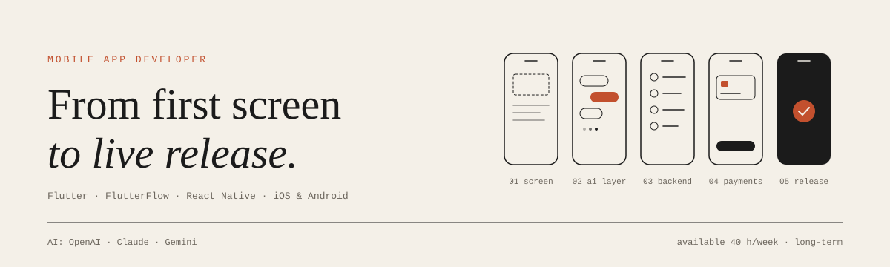

<picture>
  <source media="(prefers-color-scheme: dark)" srcset="assets/header-dark.svg">
  
</picture>

<br>

I build cross-platform mobile apps with Flutter, FlutterFlow, and React Native, and have been doing it for 5 years.

Most of my work now involves AI inside the app: chatbots, streaming responses, LLM-powered features on the OpenAI, Claude, and Gemini APIs. Features that go to production, not demos. I take care of both the app and the AI layer, from the first screen to the release on the App Store and Google Play.

```
frameworks ....... Flutter, FlutterFlow, React Native
platforms ........ iOS, Android
ai ............... OpenAI, Claude, Gemini — chatbots, streaming, LLM features
backend .......... Firebase, Supabase, REST APIs
payments ......... payment gateways, in-app purchases, subscriptions
release .......... App Store, Google Play
availability ..... 40 h/week, long-term
```

I ship in small, testable steps and write code the next person can build on. AI-assisted tooling helps me move faster, but quality still comes first.

If you have an app to build, one to improve, or an AI feature to add, message me with a bit about the project.
